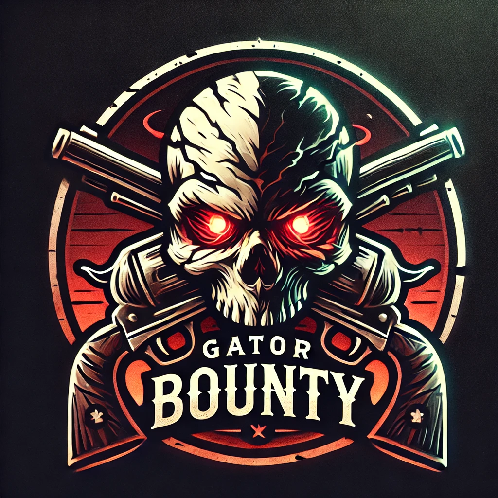

# Gator Bounty - V Rising Bounty System

## Features
- Announce bounties based on killstreaks or player set bounties
- Bounty Leaderboard
- Players can use currency to place bounties on others
- Skull icons on the map for players with high bounties

## Setttings

```ini
[General]

## Announce bounties in chat
# Setting type: Boolean
# Default value: true
AnnounceBounty = true

## Prefab GUID for the currency for bounty system
# Setting type: String
# Default value: 576389135
bountyCurrency = 576389135

## Name of currency for bounty system
# Setting type: String
# Default value: Greater Stygian Shards
bountyCurrencyName = Greater Stygian Shards

## How much each kill is worth towards bounty
# Setting type: String
# Default value: 50
bountyKillValue = 50

## Killstreak size for bounty to start
# Setting type: String
# Default value: 7
bountyAnnounceValueKill = 7

## Killstreak size for bounty map icon to start
# Setting type: String
# Default value: 12
bountyMapValueKill = 12

## Bounty price amount for bounty to start
# Setting type: String
# Default value: 500
bountyAnnounceValueReward = 500

## Bounty price amount for bounty map icon to start
# Setting type: String
# Default value: 1000
bountyMapValueReward = 1000
```

## https://vrisingmods.com/discord

Crimson Sanctuary Duos PvP Server:
## https://discord.gg/eTrRngjXVW


# Changelog
- 1.0.0
	- Initial release